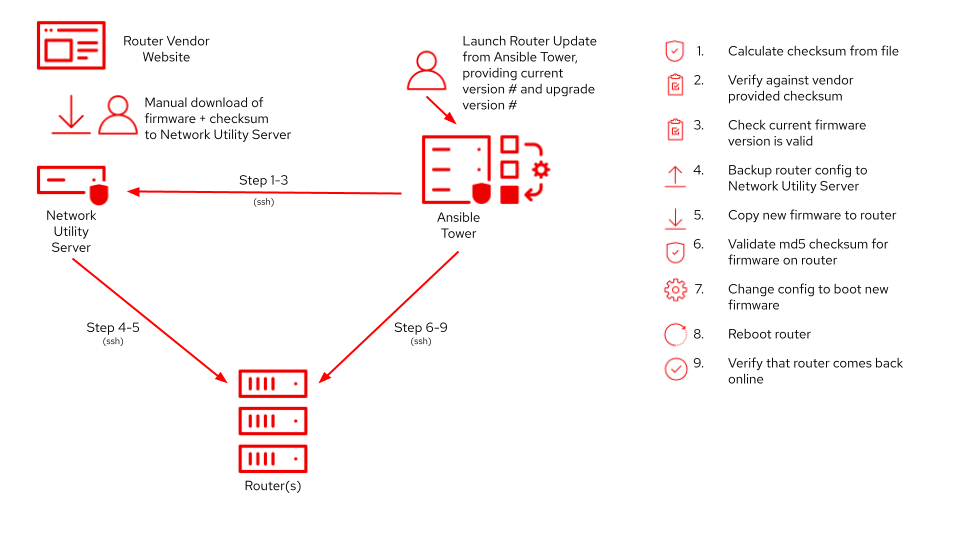

# network-firmware-update
Updating firmware on network devices with Ansible and AAP

PoC on updating firmware on a Cisco Switch



# Prereq

On Tower system
```
source /var/lib/awx/venv/ansible/bin/activate
umask 0022
pip install scp
chown awx:awx -R /var/lib/awx/venv/ansible/bin/activate
```
